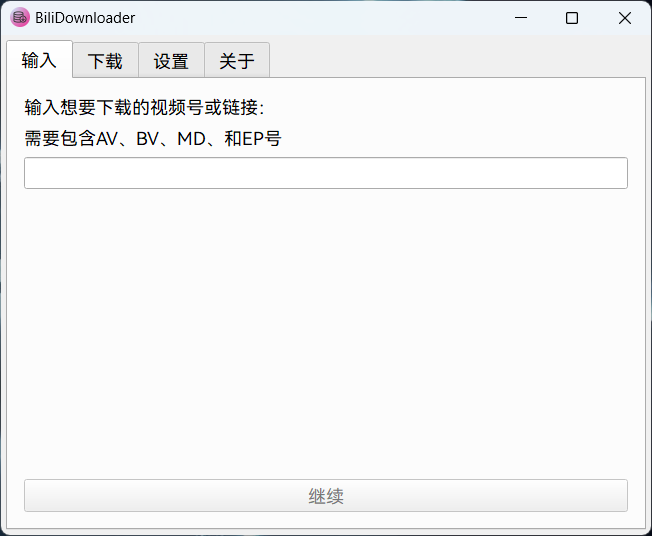
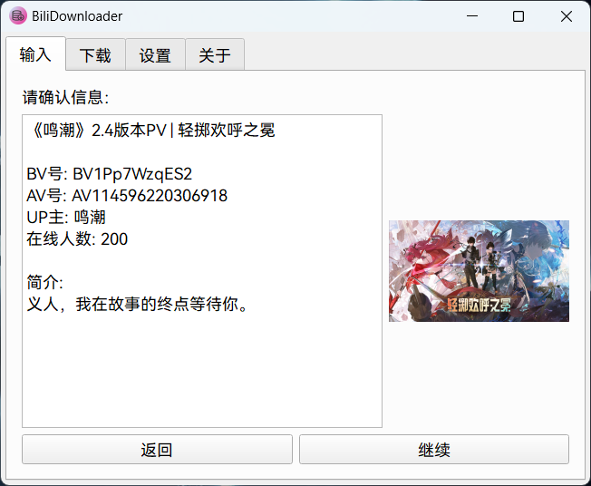
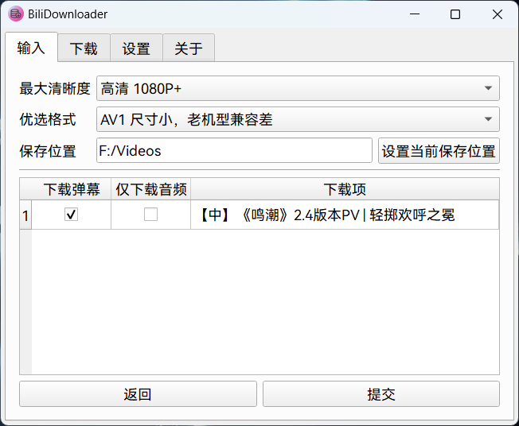
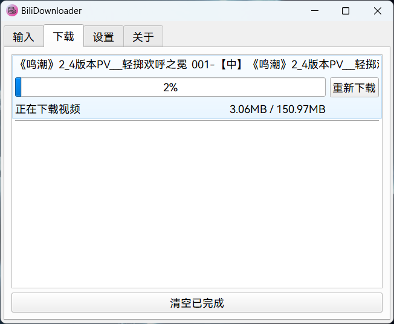

# BiliDownloader

  

## 介绍

这是一款开源的 b 站 视频下载器

## 使用

发行版在Windows中安装即可使用

输入BV号、AV号、MD号或EP号即可获取视频 (MD号是指番剧详情页面链接上的**mdxxxx**)

------

你可以在**设置界面**设置<u>下载位置</u>

在部分情况下，你需要在设置界面通过二维码登录b站账号来下载部分会员资源

***本应用不提供会员资源的直接下载。如需下载会员资源，请登录拥有大会员的账号进行下载操作***

------

确认信息后，选择分集，左侧打勾即可下载

------

在下一页，选择视频清晰度和视频编码，你也可以在这里临时修改保存路径

------

随后点击提交即可开始下载

------

## 注意事项

目前暂不提供 **杜比音效** 资源的下载

部分视频需要 **大会员** 才能下载完整视频，请在<u>**设置**</u>中登录账号

部分清晰度需要 **大会员** 才能下载，请在设置中登录

## 其他

Windows可执行文件通过Nuitka构建

## 演示图片

