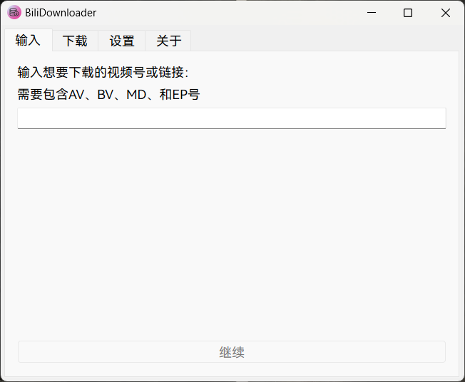
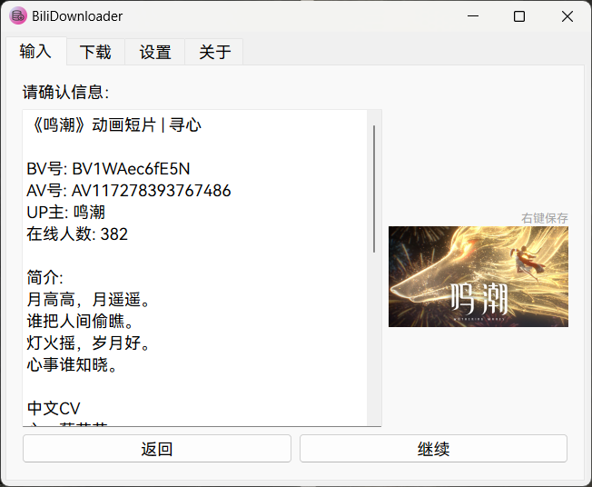
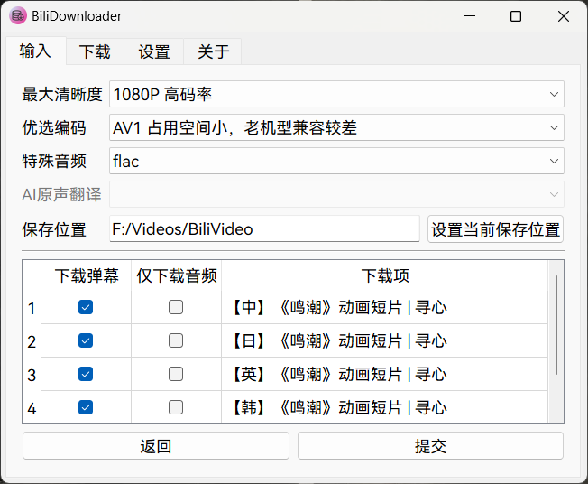
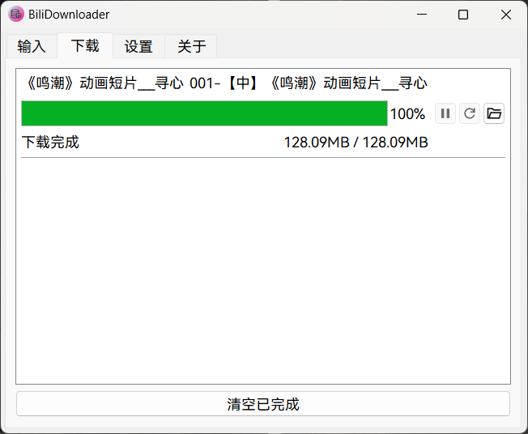

# BiliDownloader

 

## 介绍

这是一款开源的 b 站 视频下载器

## 使用

发行版在Windows中安装即可使用

输入BV号、AV号、MD号或EP号即可获取视频 (MD号是指番剧详情页面链接上的**mdxxxx**)



------

你可以在**设置界面**设置<u>默认下载位置</u>

在部分情况下，你需要在设置界面通过二维码登录b站账号来下载部分会员资源

确认信息后，选择分集，打勾即可下载

在下一页，选择视频清晰度和视频编码，你也可以在这里临时修改保存路径

随后点击提交即可开始下载

## 注意事项

***本应用不提供会员资源的直接下载。如需下载会员资源，请登录拥有大会员的账号进行下载操作***

部分视频需要 **大会员** 才能下载完整视频，请在 <u>**设置**</u> 中登录账号

部分清晰度需要 **大会员** 才能下载，请在设置中登录

## 其他

Windows可执行文件通过Nuitka构建

## 命令行使用

命令行入口复用现有下载逻辑，不启动图形界面。安装 Python 3.10+ 后，在项目目录执行：

```shell
python -m pip install -e .
bili info BVxxxxxxxxxx
bili formats BVxxxxxxxxxx --page 1
bili download BVxxxxxxxxxx --output ./downloads --quality 80

# 不安装项目时，也可以直接运行脚本
python src/bili_cli.py info BVxxxxxxxxxx
```

CLI 默认复用 GUI 的 `data/userdata.json` 下载目录、编码、音频、弹幕和登录设置，并向标准输出写入 JSONL 事件，便于脚本或 AI 逐行解析。也可以用 `--cookie-file` 或 `BILI_COOKIE` 临时覆盖登录设置。合并音视频时可通过 `--ffmpeg` 或 `BILI_FFMPEG` 指定 FFmpeg。

从其他目录调用时，可以用 `--config-dir` 指向 GUI 的工作目录；命令行布尔选项支持对应的 `--no-*` 形式覆盖 GUI 设置。

## 演示图片








尾注：感谢[吾爱破解论坛](www.52pojie.cn)

maj001@www.52pojie.cn
